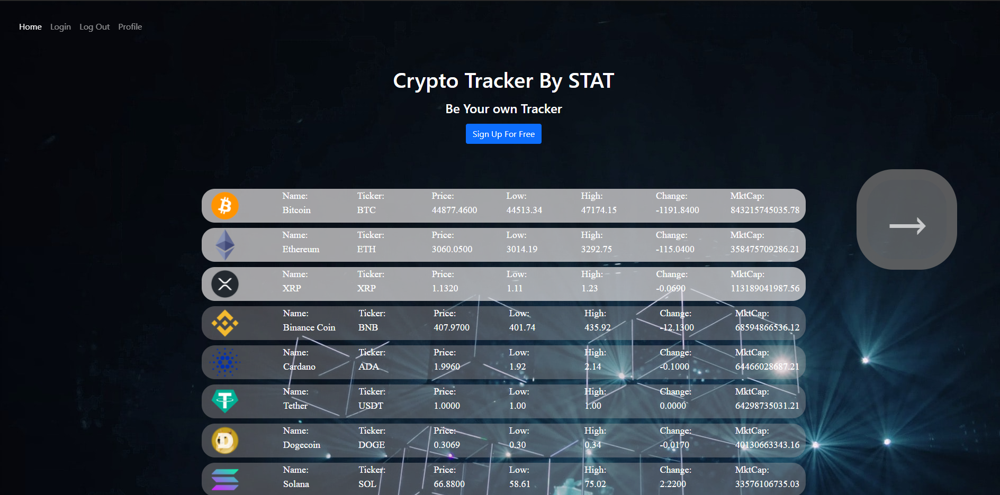

# Crypto-Tracker, by STAT

## Developed By: Sam Morgen, Timothy Sepulvado, Andrew Bwogi, Troy Grossi

 
 

# Description

Crypto Tracker provides real time essential market data for the most popular cryptos

# Table of Contents

- [Installation](#installation)

- [Usage](#usage)

- [Contribution](#contribution)

- [License](#license)

<!---->

- [Questions](#questions)

# Installation

Download the project from github. Must have node, mysql, and npm downloaded on your client. Type "npm install" in the terminal from the root of this project to download the dependencies. You then must create a .env file that corresponds with the variables DB_NAME, DB_USER, DB_PW, and SECRET. Next, type "mysql -u root -p"in the terminal to open the mysql terminal. From within the mysql terminal, type "source db/schema.sql" to link the database with mysql. From here everything will be up and running.

- Dependencies: node, express, express-handlebars, express-session, mysql2, sequelize, connect-session-sequelize, mbd, mdb, jquery, dotenv, bcrypt, bootstrap

# Usage

- Hit the left and right arrow to scroll through the most popular cryptocurrencies
- Sign-up to create a profile
- Click on the cryptos to save them to your profile
- Navigate to your profile to view your saved cryptos
- Log-out to exit your profile
- Log-in to eneter your profile

<!---->

Screenshot:

<!---->

# Contribution

Refer to:
[Contribution Convenant](https://www.contributor-covenant.org/version/2/0/code_of_conduct/code_of_conduct.md)

# License

MIT

# Questions

Ask questions at our github

- GitHub Link: https://github.com/troygrossi/Crypto-Tracker
